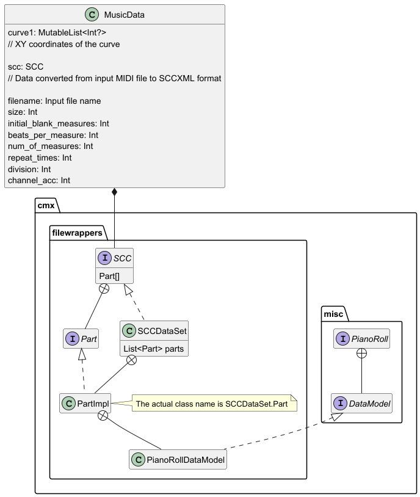
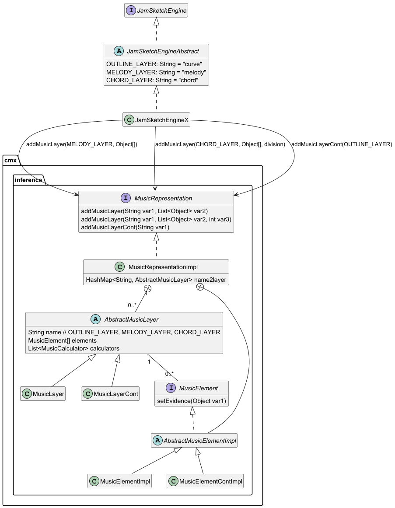
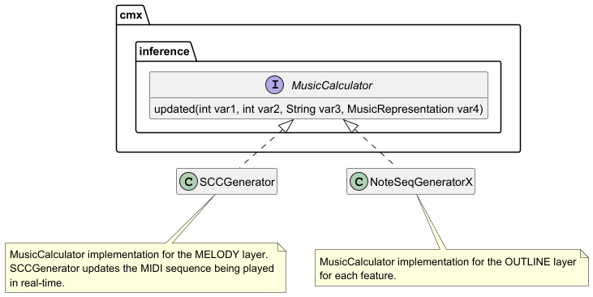

### Main Classes in JamSketch

#### JamSketch is an extension of the processing PApplet

#### MusicData
MusicData is JamSketch input and output data.

* curve1 

  curve1 holds the coordinates of the curve drawn by the user.

  * scc

    scc is generated by reading from a MIDI file. 
    It is both input and output data.
    JamSketch updates the generated performance in real-time while playing the scc.

#### JamSketchEngines and MusicRepresentation

By separating the engine for each feature, JamSketch uses the appropriate MusicCalculators.
JamSketch uses the engine defined in the configuration file.

The elements of music are represented using [CMX](https://github.com/kitaharalab/cmx), a music information processing library developed by our laboratory.

The "X" in "JamsketchEngineX" in the diagram is the name of the feature.

#### MusicCalculators

In JamSketch, the MusicCalculators of each layer work together to perform the process.

##### NoteSeqGenerators

By separating the music generation for each feature, it can be implemented in a variety of ways.
The "X" in "NoteSeqGeneratorX" in the diagram is the name of the feature.

##### SCCGenerator

A MusicCalculator to edit scc for the generated music.